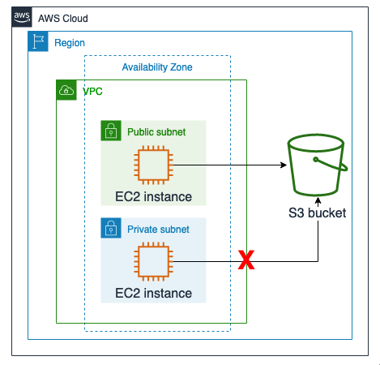
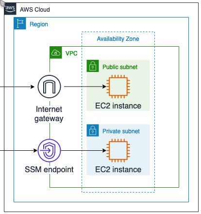
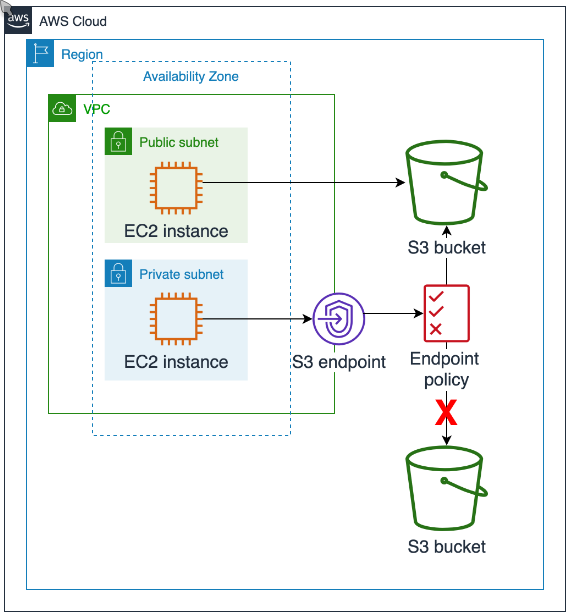

# Day ONE

## Lab 1: Securing Amazon S3 VPC Endpoint Communications

From This             |  To this
:-------------------------:|:-------------------------:
 | 

### AWSCLI usefull commands
#### Create an AWS VPC Endpoint

**To describe all vpc endpoints:**
```bash
aws ec2 describe-vpc-endpoints --query 'VpcEndpoints[*].ServiceName'
```

**To find the VPC ID:**

```bash
VPC=$(aws ec2 describe-vpcs --query 'Vpcs[*].VpcId' --filters 'Name=tag:Name, Values=labVPC' | jq -r '.[0]')
echo $VPC
```

**To find the route table id:**
```bash
RTB=$(aws ec2 describe-route-tables --query 'RouteTables[*].RouteTableId' --filters 'Name=tag:Name, Values=PrivateRouteTable' | jq -r '.[0]')
echo $RTB
```

**To create an Amazon S3 endpoint:**
```bash
export AWS_REGION=$(curl -s 169.254.169.254/latest/dynamic/instance-identity/document | jq -r '.region')
echo $AWS_REGION
aws ec2 create-vpc-endpoint \
    --vpc-id $VPC \
    --service-name com.amazonaws.$AWS_REGION.s3 \
    --route-table-ids $RTB
```

### Adding a VPC Endpoint Policy

**Infrastructure Diagram:**
Would end up lookign somethis like this |
:--------------------------------------:|
 |

**We would use this policy as starting point:**

```json
{
    "Version": "2012-10-17",
    "Statement": [
        {
            "Effect": "Allow",
            "Principal": "*",
            "Action": "s3:List*",
            "Resource": "arn:aws:s3:::*"
        },
        {
            "Effect": "Allow",
            "Principal": "*",
            "Action": "s3:*",
            "Resource": [
                "arn:aws:s3:::<LabBucket>",
                "arn:aws:s3:::<LabBucket>/*"
            ]
        },
        {
            "Effect": "Deny",
            "Principal": "*",
            "Action": "s3:*",
            "Resource": [
                "arn:aws:s3:::<LabLoggingBucket>",
                "arn:aws:s3:::<LabLoggingBucket>/*"
            ]
        }
    ]
}
```

**Find the VPC Endpoint ID**

```bash
export vpcEndpointId=$(aws ec2 describe-vpc-endpoints --query 'VpcEndpoints[?contains(ServiceName, `s3`) == `true`].VpcEndpointId' --output text)
echo ${vpcEndpointId}
```

**Attach the policy to the VPC Endpoint**
```bash
aws ec2 modify-vpc-endpoint --vpc-endpoint-id ${vpcEndpointId} --policy-document file://policy.json
```


