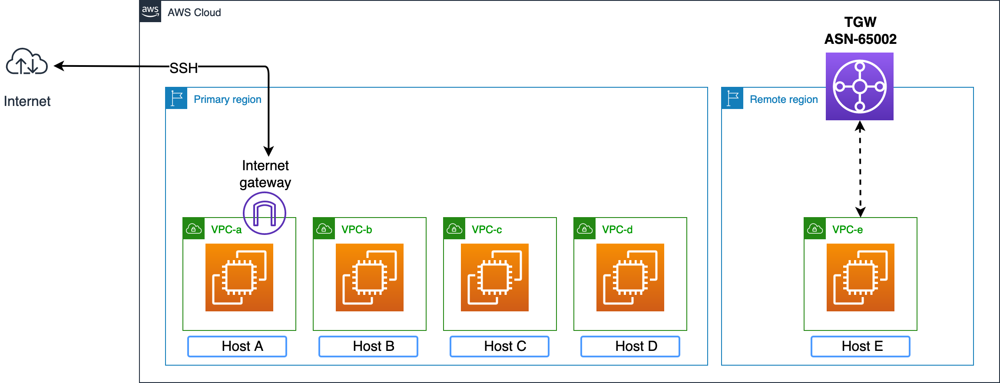
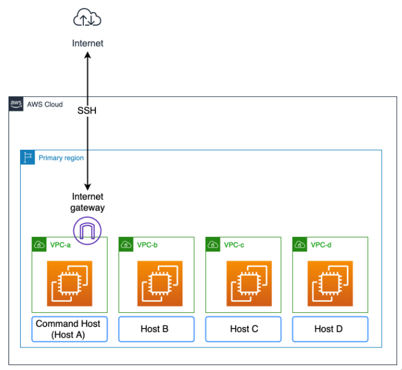
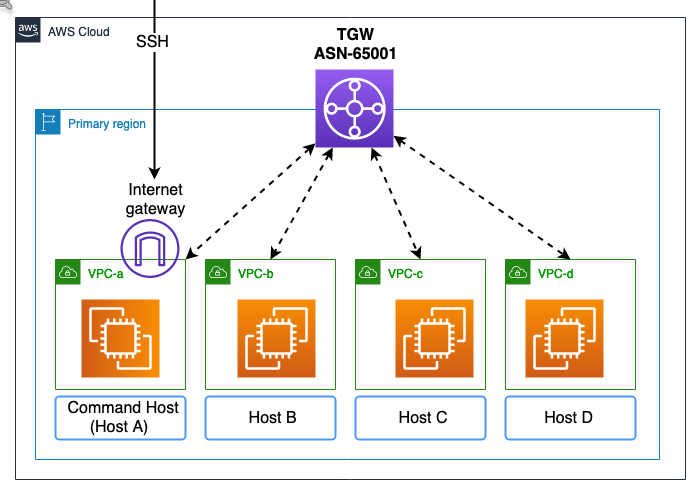

# Day TWO

## Lab 2: Configuring transit gateways

 

------------------------------------

### Starting Network topology

We can see **4 EC2 instances** running, each one on a **separate VPC**. If we try to reach one from another one we would not success.

To to able to reach among these instances, let's create an **AWS Transit Gateway** and via the **AWS Transit Gateway Attachment** attach all the 4 VPCs.

Now, let's create the **Transit Gateway Rout Table** ans associate/propagate all of the previous created attachments to this route table in the Associations/Propagations tab.
Associating an attachment to a route table, allows traffic to be sent from the attachment to the target route table.

Now lets edit 4 route tables of the following VPCs:
1. *vpc_a-public* 
2. *vpc_b-private* 
3. *vpc_b-private* 
4. *vpc_d-private* 

and add the following rule: `10.0.0.0/8` --> `<Transit-Gateway-ID>`. Now we are able to reach every host.

### Peering an external region

