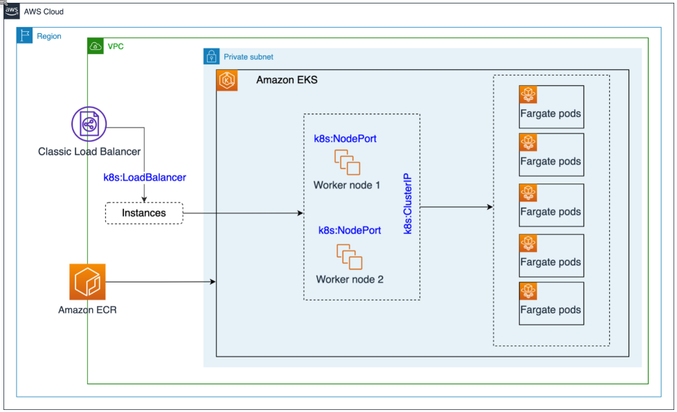
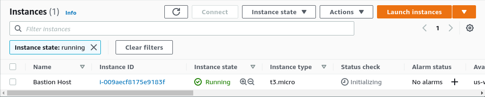
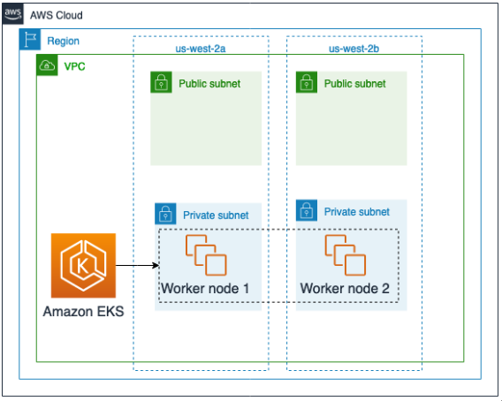

# Day TWO

## Lab 3: Deploying an application with Amazon EKS on Fargate

 

 ## Connect to the Bastion host
 
We already have one created



Inside the Bastion host, run the following script to install docker and set the correct credentials. `kubectl` and `eksctl` were pre-installed for this lab.

```bash
mkdir environment && \
cd ~/environment && \
wget https://aws-tc-largeobjects.s3-us-west-2.amazonaws.com/ILT-TF-300-ADVARC-3/lab-3/code-lab3-v301.zip  && \
unzip code-lab3-v301.zip && \
touch /tmp/install.log && \
export log_file="/tmp/install.log" && \
chmod +x init-docker.sh && \
./init-docker.sh | tee -a "$log_file"
```

**Lets verify the installation:**
```bash

docker version
eksctl version
kubectl version
```

*< We have built a Docker image with the "app" we want to deploy>*

**We would get the EC2 Public IP:**
```bash
curl http://169.254.169.254/latest/meta-data/public-ipv4 -w "\n\n"
```

**Creating an ECR Repository for our image**
```bash
aws ecr create-repository --repository-name web2048/website
```
We should expect the following output:
```json
sh-4.2$ aws ecr create-repository --repository-name web2048/website
{
    "repository": {
        "repositoryArn": "arn:aws:ecr:us-west-2:589058370351:repository/web2048/website",
        "registryId": "589058370351",
        "repositoryName": "web2048/website",
        "repositoryUri": "589058370351.dkr.ecr.us-west-2.amazonaws.com/web2048/website",
        "createdAt": "2021-06-02T13:54:15+00:00",
        "imageTagMutability": "MUTABLE",
        "imageScanningConfiguration": {
            "scanOnPush": false
        },
        "encryptionConfiguration": {
            "encryptionType": "AES256"
        }
    }
}
```

**To get the repository URL:**
```bash
aws ecr describe-repositories --query 'repositories[].[repositoryName, repositoryUri]'--output table
```

**Export the URL:**
To export the value of the repository to the environment, run the following command:
```bash
export REPOSITORY_URI=$(aws ecr describe-repositories --query 'repositories[].[repositoryUri]' --output text)
echo ${REPOSITORY_URI}
```

**Login to the repository:**
Before pushing the image to ECR we must first login to the repository.
The [**get-login** command](http://docs.aws.amazon.com/cli/latest/reference/ecr/get-login.html) returns a `docker login` token, which is valid for 12 hours. You can pipe the output from this command to a shell to run the `docker login` command to complete the authentication.
```bash
export ACCOUNT_ID=$(aws sts get-caller-identity --output text --query Account)
export AWS_REGION=$(curl -s 169.254.169.254/latest/dynamic/instance-identity/document | jq -r '.region')
aws ecr get-login-password --region ${AWS_REGION} | docker login --username AWS --password-stdin ${ACCOUNT_ID}.dkr.ecr.${AWS_REGION}.amazonaws.com
```


**Tag and Push:**
Now tag the images with the URI of the repository and push it:
``` bash
docker tag web2048/website:latest ${REPOSITORY_URI}:latest
docker push ${REPOSITORY_URI}:latest
```

## Explore the Deployed Amazon EKS Cluster and [Managed Node Group](https://docs.aws.amazon.com/eks/latest/userguide/managed-node-groups.html)
 

Run the following commands to explore the cluster:
```bash
sh-4.2$ eksctl get clusters
2021-06-02 14:10:37 [ℹ]  eksctl version 0.52.0
2021-06-02 14:10:37 [ℹ]  using region us-west-2
NAME            REGION          EKSCTL CREATED
ekscluster      us-west-2       True
sh-4.2$ kubectl get svc
NAME         TYPE        CLUSTER-IP   EXTERNAL-IP   PORT(S)   AGE
kubernetes   ClusterIP   172.20.0.1   <none>        443/TCP   32m
sh-4.2$ kubectl get nodes
NAME                                       STATUS   ROLES    AGE   VERSION
ip-10-0-1-172.us-west-2.compute.internal   Ready    <none>   17m   v1.18.9-eks-d1db3c
ip-10-0-2-196.us-west-2.compute.internal   Ready    <none>   17m   v1.18.9-eks-d1db3c
```

**Lets now explore the Fargate profile that's created**
```bash
sh-4.2$ eksctl get fargateprofile   --cluster ekscluster   -o yaml
- name: 2048-game
  podExecutionRoleARN: arn:aws:iam::589058370351:role/eksctl-ekscluster-fargate-FargatePodExecutionRole-F3QKY1IM9WSN
  selectors:
  - namespace: 2048-game
  status: ACTIVE
  subnets:
  - subnet-0c678abe3e575215b
  - subnet-08a69e0d2bd9dbcf8
```

## Let now deploy the Service Type load balancer

To do so, just run the following command.

```bash
export REPOSITORY_URI=$(aws ecr describe-repositories --query 'repositories[].[repositoryUri]' --output text)
echo ${REPOSITORY_URI}
cd ~/environment/fargate
sed -i 's|REPOSITORY_URI|'${REPOSITORY_URI}'|' 2048-game.yaml
kubectl apply -f 2048-game.yaml
```

**Check the deployment status**
```bash
kubectl -n 2048-game rollout status deployment 2048-deployment
```

Once the deployment is finished, list the status of the pods and the newly provisioned argate worker nodes they are running on with the following command:
```bash
kubectl get pods -n 2048-game -o=custom-columns=NAME:.metadata.name,STATUS:.status.phase,NODE:.spec.nodeName
```

**To check everything is up and running:**
```bash
kubectl get pods -n 2048-game -o=custom-columns=NAME:.metadata.name,STATUS:.status.phas
e,NODE:.spec.nodeName
```

```
NAME                              STATUS    NODE
2048-deployment-874fd9446-fzc4m   Running   fargate-ip-10-0-4-132.us-west-2.compute.internal
2048-deployment-874fd9446-qvsvj   Running   fargate-ip-10-0-3-28.us-west-2.compute.internal
2048-deployment-874fd9446-vtbgd   Running   fargate-ip-10-0-3-238.us-west-2.compute.internal
2048-deployment-874fd9446-xw5wn   Running   fargate-ip-10-0-3-196.us-west-2.compute.internal
2048-deployment-874fd9446-zfgp8   Running   fargate-ip-10-0-3-222.us-west-2.compute.internal
```

```bash
kubectl get nodes 
```
```
NAME                                               STATUS   ROLES    AGE     VERSION
fargate-ip-10-0-3-196.us-west-2.compute.internal   Ready    <none>   2m34s   v1.18.9-eks-866667
fargate-ip-10-0-3-222.us-west-2.compute.internal   Ready    <none>   3m25s   v1.18.9-eks-866667
fargate-ip-10-0-3-238.us-west-2.compute.internal   Ready    <none>   2m28s   v1.18.9-eks-866667
fargate-ip-10-0-3-28.us-west-2.compute.internal    Ready    <none>   3m28s   v1.18.9-eks-866667
fargate-ip-10-0-4-132.us-west-2.compute.internal   Ready    <none>   3m30s   v1.18.9-eks-866667ip-10-0-1-172.us-west-2.compute.internal           Ready    <none>   27m     v1.18.9-eks-d1db3c
ip-10-0-2-196.us-west-2.compute.internal           Ready    <none>   27m     v1.18.9-eks-d1db3c
```

```bash
kubectl get svc -n 2048-game
```
```
NAME           TYPE           CLUSTER-IP    EXTERNAL-IP                                                               PORT(S)        AGE
service-2048   LoadBalancer   172.20.8.80   a417fa6d57bf1407bbdde572246c0d31-1660622535.us-west-2.elb.amazonaws.com   80:32282/TCP   7m20s
```
