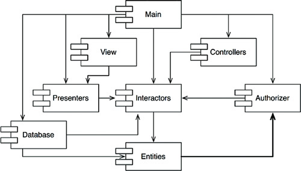
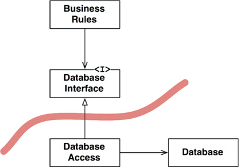
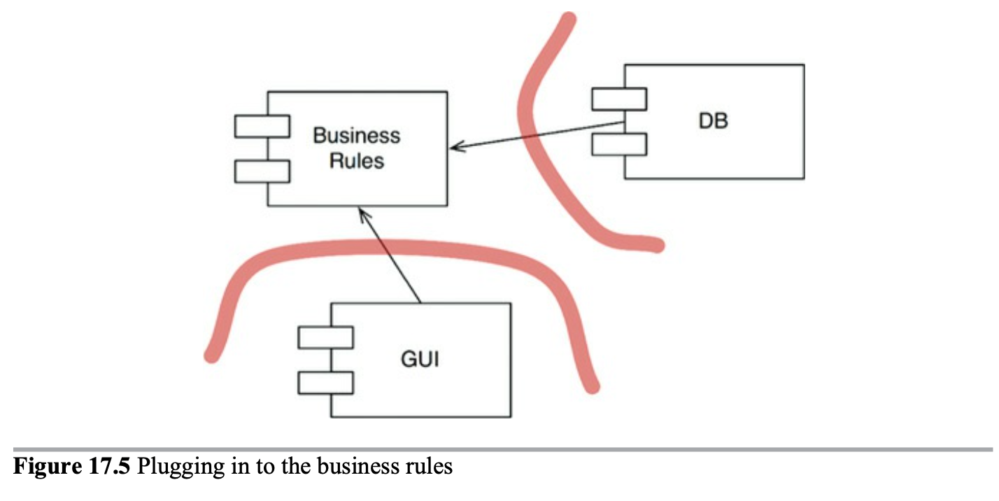

# Clean Architecture

## Foreword

Describing software through architecture can reveal as much as it hides. It can both promise more than what it can delivers and deliver more than what it promises.

 *Architecture represents the significant design decisions that shape a system, where significant is measured by cost of change.* - *Grady Booch*

Time, money and effort give us a sense of scale to short between the large and the small, to distinguish the architectural stuff from the rest. A good architecture should not only meet the need of its users, developers, and owners at a given point in time, but it also meets them over time.

*If you think good architecture is expensive, try bad architecture.* - *Brian Foote and Joseph Yoder*

The path we are most interested is  the cleanest one, where we recognize the softness of software and preserve it as a first-class property of the system. Recognize that we operate with incomplete knowledge, but also understand that as humans is something we're good at. Play more to our strength than to our weaknesses. 

*Architecture is a hypothesis, that needs to be proven by implementation and measurement.* - *Tom Glib*

To walk this path requires care and attention, thought and observation, practice and principle.  This at first might sound slow, but it's all in the way that you walk.

*Slow and steady wins the race.*

## Preface

Uncle Bob claims to have taken part and tons of different systems from games to multi-threaded, multi processor, GUI and databases apes and all of them follows the same rules.

He concludes "*the rules of software architecture are independent of every other variable.*" He based on the fact that even though technology has improved drastically in term of new hardware more libraries and new languages, the bases are the same. It's made of the same stuff. It's made of `if` statements, assignments statements, and `while` loops. This changeless NESS of the code is the reason that the rules o software architecture are so consistent across system types. Nevertheless, one thing has changed: Back then, they didn't know what the rules were.

## Introduction

Getting something to work --once-- just isn't that hard. Getting it right is another matter entirely. Getting software right is hard and most young programmers don't have what it needs or simply doesn't care about writing clean code.

When you get software right, something magical happens: You don't need hordes of programmers to keep it working. You don't need massive requirements documents and huge issue tracking systems. When software is done right it requires a fraction the human resources to create and maintain.

Unfortunately, It is far more common to fight your way through terrible software designs that it is to enjoy the pleasure of working with a good one.

# Part I: What is design and architecture ?

There has been a lot of confusion about design and architecture over the years and one of the goals of this book is to cu through all that confusion and to define what architecture and design are. For starters, there's no difference at all.

The work *architecture* is often used in the context of something at a high level that is divorced from the lower-level details, whereas *design* more often seems to imply structures and decisions at a lower level. But this usage is nonsensical when you look at what a real architect does. 

### The goal

Both design and architecture can be used to describe a continuum of decisions from the highest to the lowest levels. And what drives that decision ? 

*The goal of software architecture is to minimize the human resources required to build and maintain the required system.*

Once again like in the foreword remark the importance of taking the time to think thing through by stating several quotes and showing a case study on the matter.

*The race is not to the swift, nor the battle to the strong.*

*The more haste, the less speed.*

*Making messes is always slower than staying clean.*

*The only way of going fast, is to go well*

The developers may think that the answer is to start over from scratch and redesign the whole system --  but that's just the hare talking again.

*Their overconfidence will drive the redesign into the same mess as the original project.*

## A tale of two values

Uncle bob says that software mainly provide two values: **Behavior** and **Architecture**. 

### Behavior

**Behavior** , making a machine behave in a way that meets the stakeholders requirements. Functionality. Some programmers think this is their entire job. They think that their job is to implement requirements and fix bugs. They are sadly wrong.

### Architecture

**Architecture**, has to do with the word software. *ware* being product and the word *soft* that is where the second value lies.

Software was invented to be *soft*. It was intended to be a way to easily change the behavior of machines. If we'd wanted the behavior of machines to be hard to  change, we would have called it *hardware*.

Architecture should be agnostics of shape.

### Eisenhower Matrix:

 *The urgent is not important and the important are never urgent.* 

Those things that are urgent are rarely of great importance, and those things that are important are seldom of great urgency.

The first value of software --behavior-- is urgent but not always important.

The second value of software --architecture-- is important but never particularly urgent.

1. Urgent and Important
2. Not urgent and important
3. Urgent and not important
4. Not Urgent and not important

Business managers and developers often place the 3 option to the first place.

# Part II: Starting from the brick: Programming paradigms

 First programming revolution was that of languages. Languages relieved the programmers of the drudgery of translating their programs into binary.

Another revolution, probably more significant, revolution was in programming paradigms. Paradigms area ways of programming, relatively unrelated to languages. ***A paradigm tells you which programming structures to use, and when to use them***. To date, there have been three such paradigms and there are unlikely to be any others. 

## Paradigm overview

The three paradigms included in this overview are **Structured**, **Object oriented** and **Functional.**

### Structured

The first one to be adopted (but no the first to be invented) was structured programming, discovered by Dijkstra. He showed that the use of unrestrained jumps (`goto` statements) is harmful to program structure so he replaced those jumps with the more familiars `if/then/else` and `do/while/until` constructs.

*Structured programming imposes discipline on direct transfer of control*

### Object Oriented

Two years earlier Object oriented programming was discovered by Ole and Kristen. These two programmer noticed that the function call stack frame in the `ALGOL` language could be moved to a heap, thereby allowing local variables declared by a function to exist long after the function returned. The function become a constructors for a class, the local variables became instance variables, and the nested functions became methods. This lead inevitably to the discovery of polymorphism through the disciplined use of function pointers.

*Object-oriented programming imposes discipline on indirect transfer of control*

### Functional

The first to be invented was functional programming. Its  invention predates computer programming itself. Derived from 1-Calculus, its main foundational notions is immutability -- that is, the notion that the values of symbols do not change. 

*Functional programming imposes discipline upon assignment*

### Food for thought

Notice the pattern that I've quite deliberately set up in introducing these three programming paradigms: Each of them removes capabilities from the programmer. None of them adds new capabilities. Each imposes some kind of extra discipline that is negative in its intent. The paradigms tell us what not to do, more than they tell us what to do.

Every paradigm takes aways something. The three paradigms together remove `goto` statements, functions pointers, and assignment. Is there anything left to take away ? These were discovered in the span of 10 years, in the many decades that have followed, no new paradigms have been added.

### Conclusion

What does this has to do with architecture ? We use polymorphism as the mechanism to cross architectural boundaries; we use functional programming to impose discipline on the locations of and access to data; and we use structured programming as the algorithmic foundation of our models. Notice how well those thee align with the three big concerns of architecture function, separation of components, and data management.

## Structured Programming

Dijkstra realized that programming is hard and that programmer don't do it very well. A program of any complexity contains too many details for a human brain to manage without help.  To solve this issue, Dijkstra tried to apply the mathematical discipline of proof. His vision was the construction of Euclidean hierarchy of postulates, theorems, corollaries, and lemmas. Programmer would use proven structures, and tie them together with code that they would prove correct themselves. He discovered that certain uses of `goto` statements prevent modules  from being decomposed recursively into smaller units therefore preventing the use of the divide-and-conquer approach necessary for reasonable proofs. However, other uses of goto didn't have this problem. He realized that this *good* uses of `goto` corresponds to simple selection and iteration control structures. All programs can be constructed with three structures: Sequence, Selection and Iteration. This very same structures made a program provable.

The Euclidean hierarchy of theorems was never built. And programmers never saw the benefits of working through the laborious process of formally proving each and every little function correct. Of course, formal, Euclidean style, mathematical proofs is not the only strategy for proving something correct. Another highly successful strategy is the scientific method. Proving thins incorrect. That's the nature of scientific theories and laws: They are falsifiable but not provable. Science work by proving statement false, not true. We take as true the statements that, after a long time, we couldn't prove true. 

### Tests

Dijkstra once said: *"Testing shows the presence, not the absence, of bugs".* Functions can be proven to be incorrect with a test, but it can't be proven correct.
Software development is not like mathematical endeavor, even though is it seems to manipulate mathematical constructs. Rather, software is like science. We show correctness by failing in proving incorrectness.

### Conclusion

In conclusion, structured programming is this ability to create falsifiable units of programming that makes structured programming valuable today.
At the architecture level, this is why we still consider functional decomposition to be on of our best practices. 

## Object Oriented Programming

The basis of a good architecture is the correct understanding and application of the principles of Object-oriented design (OO) OO Design is the combination of data and function but is also explain as "A way to model the real world".  The three magic word to explain OO are encapsulation, inheritance and polymorphism.

### Encapsulation

The encapsulation of data and functions lets us draw a line and bound these together but the idea is certainly not unique to OO. Indeed, we had perfect encapsulation in C. Perfect encapsulation in a non-OO language.
C#, Java and some OO language it's imposible to separate the declaration and definition of a class. Therefore they abolished the header/implementation like pure `C` ,where you would have a `library.h`, weakening encapsulation.
For these reasons it is difficult to accept that OO depends on strong encapsulation. In fact, many OO languages have little or no enforced encapsulation at also.

### Inheritance

Inheritance is simply the redeclaration of a group of variables and functions within an enclosing scope. We could do this with C long time ago or at least we had a trick, but it's not inheritance per se. Moreover, multiple inheritance is considerably more difficult to achieve with such trickery.
It's fair to say that while OO did not give us something completely brand new, it did make the masquerading of data structures significantly more convenient.

### Polymorphism

We did have polymorphism in languages before OO. For example in the `getchard()` and `putchar()` which read and write from the STDIN and STDOUT. The UNIX operating system requires that every IO devices drivers provide five standard functions: `open`, `close`, `read`, `write` and `seek` and `seek`. The signatures of these functions must be identical for every IO driver The bottom line is that polymorphism is an application of pointers to functions. Programmers have been using these to achieve polymorphic behavior since 1940s. In other word, OO has provide nothing new.

The problem with pointers to functions is that they are dangerous. Such use is driven by a set of manual conventions. If any programmer fails to remember these conventions, the resulting bug can be hard to track down and eliminate. OO languages eliminate these conventions and, therefore, these dangers. Using OO languages, polymorphism is trivial. That fat provides enormous power that old C programmer could only dream of. On this basis, we can conclude that OO imposes discipline on indirect transfer of control. 

### The power of polymorphism

The power of polymorphism lays on the fact that by implementing functions in, for example, UNIX IO drivers, then we can assure that the program that use those functions does not depend on the source code of those "not-dependencies" (IO Drivers.)
In short IO drivers have become plugins to out program. The plug-in architecture has been interested to achieve IO devices independence, and has been implemented in almost every operating system since its introduction.
OO allows the plug-in architecture to be used anywhere, for anything.

### Dependency Inversion

Before a safe and convenient mechanism for polymorphism was available, `Flow control` and `Source Code Dependency` followed the same path. In the typical calling tree, main functions called high-level functions, mid-level functions, which called low-level functions.
In this scenario the flow of control was dictated by the behavior of the dependencies and the dependencies were dictated by that flow control.
When polymorphism brought into play, something very different can happen.

In `Figure 1` we can see the classical approach where Flow of control goes on the same direction as the dependency. `Figure 2`, shows us how *Object A* a high-level function calls a functions in *Object B* a middle-level function. The fact that it calls this function through the interface is a source code contrivance. At runtime, the interface doesn't exist. *Object A* simply calls the function within *Object B* Notice that here the flow of control still goes from *Object A* the high-level function to the low-level function *Object B*. The fact that OO languages provide safe and convenient polymorphism means that any source code dependency, no matter where it is, can be inverted by inserting an interface between them. That's the power that OO provides. That's what OO is really all about- at least from an architect point of view. 
As an example, you can rearrange the source doe dependencies of your system so that the database and the user interface (UI) depend on the business rules rather than the other way around.
This means that the Database and de UI can be plugins to the business rules. This means that the business rules never mentions the UI or the Database.

## Conclusion

OO is the ability, through the use of polymorphism, to gain absolute control over every source code dependency in the system. It allows the architect to create a plug-in architecture, in which modules that contain high-level policies are independent of module that contain los-level details. The low-level details are relegated to plug-in modules that can be deployed and developed independently from the modules that contain high-level policies.

# Part III: Design Principles

The SOLID principles tell us how to arrange our functions and data structures into classes, and how those classes should be interconnected. A class is simply a coupled grouping of functions and data. Every software system has such groupings, Wether they are called classes or not. The SOLID principles apply to those groupings.

## S.O.L.I.D

The goal of the principles is the creation of mid-level software structures that:

* Tolerate change
* Are easy to understand
* Are the basis of components than can be used in many software systems

## Single responsibility principle (SRP)

Of all of the SOLID principles, the SRP might be the least understood and it might be due to its name. It is too easy for programmers to hear the name and then assume that it means that every module should do just one thing.
Make no mistake, there is a principle like that. A **function** should do one, and only one, thing. We use that principle when we are refactoring large functions into smaller functions; we use it at the lowest levels. But it is now one of the SOLID principles-- it is not SRP.

A module should be responsible for one and only one actor (An actor being a group of users or stakeholders that will be likely to request changes to the system).

Now, what do we mean by the word "module" ? The simplest definition is just a source file. Most of the time that definition works fine. Some languages and development environments, though, don't use source files to contain their code. In those cases a module is just a cohesive set of functions and data structures.

[SEE THE EXAMPLE OF THE EMPLOYEE ON THE BOOK]

To conclude, the single responsibility principle is about functions and classes but it appears in a different form at two more levels. At the level of components, it becomes the Common Clausure Principle. At the architectural level, it becomes the Axis of change responsible for the creation of Architectural Boundaries.

## The open-closed principle (OCP)

A software should be open for extension but closed for modification
In other words, the behaviour of a software artifact ought to be extendible, without having to modify that artifact. And this is the most fundamental reason that we study software architecture. A good software architecture would reduce the amount of changed code to the barest minimum. Ideally, zero.
How?  By properly separating the things that change for different reasons (SRP) and then organizing the dependencies between them (DIP).

Bellow we see an image that's fully explained on the book. I suggest reviewing this example in particularly.

If component A should be protected from changes in component B, then B depends on A. We wan the *Controller* to be protected from changes in the *Presenters*. We want to protect the *Presenters* from changes in the views. WE wan to protect the *Interactor* from changes in-- well, everything.
Why should the *Interactor* hold such a privilege position ? Because it contains the business rules, it contains the higher level policies of the application.
This is how OCP works at the architectural level. Architects separate functionality based on how, why, and when it changes, and then organize that separated functionality into a hierarchy of components. Higher-level components or protected from changes made to the lower-level components.

OCP is the one driving forces behind the architecture of systems. The goal to make te system easy to extend without incurring a high impact of change. This goal is accomplished by partitioning the system into components, and arranging from changes in lower-level components. 

## The Liskov substitution principle (LSP)

Substitutability is a principle in object-oriented programming stating that, in a computer program, if S is a subtype of T, then objects of type T may be replaced with objects of type S without altering any of the desirable properties of the program.

### LSP and architecture

In the earlier ages of OO we thought LSP as a way to guide the use of inheritance, as shown in the previous sections. However, over the years the LSP has morphed into a broader principle of software design that pertains to interface and implementations. We could have several Ruby clases that implement the same interface or we might have a set of services that all respond to the same REST interface.
In all of these situations, and more, the LSP is applicable because there are users who depend on well-defined interfaces. In conclusion, the LSP can, and should, be extended to the level of architecture. A simple violation of substitutability, can cause a system's architecture to be polluted with significant amount of extra mechanisms.

## The interface segregation principle (ISP)

The interface-segregation principle (ISP) states that no client should be forced to depend on methods it does not use. In general is harmful to depend on modules that contain more than you need. This is obviously true for source code dependencies that can force unnecessary recompilation and redeployment-- but it is also true at a much higher, architectural level.

## The  dependency inversion principle (DIP)

The dependency inversion principle (DIP) tells us that the most flexible systems are those in which source code dependencies refer only to abstractions, not to congregations.  It is the volatile concrete elements of our system that we want to avoid depending on. Those are the modules  that we are actively developing, and that are undergoing frequent change. Interfaces are less volatile that implementations. This implications boils down to a set of very specific coding practices: 

* Don't refer to volatile concrete classes. Refer to abstract interfaces instead.
* Don't derive from volatile concrete classes.
* Don't override concrete functions. Concrete functions often require source code when you override those functions, you do not eliminate those dependencies-- indeed you inherit them.
* Never mentions the name of anything concrete and volatile.

### Factories
this is the posta dd

To comply to these rules, the creation of volatile concrete objects requires special handling. The Factory pattern is a creational patter that defines an Interface for creating an object and defers instantiation until runtime. It is commonly used when you don't know how many or what type of objects will be needed until during runtime.

# Part IV:  Components principles

If SOLID principles tell us how to arrange the bricks into walls and rooms, then the component principles tell us how to arrange the rooms into buildings.

## Components
The smallest entities that can be deployed as a single unit. Examples - jar file, DLL, shared library, etc.

They can be combined into single binaries or kept separate as plugins to other binaries.
Whatever the use-case, good components always retain the ability to be independently deployable and, hence, independently developable.

## Component cohesion

There are three principles of component cohesion.

* REP:  The Reuse/Release equivalence principle
* CCP:  The Common Closure Principle
* CRP:  The Common Reuse Principle

### The reuse/release equivalence principle

**The granule of reuse is the granule of release** 

We are now living in the age of software reuse -- a fulfillment of one of the oldest promises of the object-oriented model.
From a software design and architecture point of view, this principle means that the classes and modules that are formed into a component must belong to a cohesive group classes and modules that are grouped together into a component should be releasable together though it is hard to precisely explain the glue that holds these together into a single component. 

The weakness of this principle is more than compensated by the strength of next two principle strongly define this principle in the negative sense.

### The common closure principle

**Gather into component those classes that change for the same reasons and at the same times. Separate into different components those classes that change at different times and for different reasons**

The CCP basically says that a component should not have multiple reasons to change. For most application, maintainability is more important than reusability. If the code in an application must change, you would like all of the changes to occur in one single component. 

#### Similarity with SRP
The CCP is the component form of the SRP. The SRP tells us to separate methods into different classes, if they change for different reasons. The CCP tells us to separate classes into different components, if they change for different reasons.

### The common reuse principle.

**Don't force users of a component to depend on things they don't need.**

The CRP is yet another principle that helps us to decide which classes and modules should be placed into a component. 

We want to make sure that classes that we put together into a component are inseparable--  that it is impossible to depend on some and not on the others. Otherwise, we will be redeploying more components than is necessary, and wasting significant effort.

#### Relation to ISP.

The CRP is the generic version of the ISP. The ISP advises us not to depend on classes that have methods we don't use. The CRP advises us not to depend on components that have classes we don't use. 

### The tension diagram for component cohesion

The REP and CCP are inclusive principles: Both tend to make components larger. The CRP is an exclusive principle, driving components to be smaller. It is the tension between these principles that good architects seek to resolve. 

An architect who focuses on just the REP and CRP will find that too many component are impacted when simple changes are made.. In contrast, and architect who focuses too strongly on the CCP and REP will cause too many unneeded releases to be generated.

Generally projects tend to start on the right hand of the triangle, where the only sacrifice is reuse. As the project matures, and other projects begin to draw from it, the project will slide over to the left.
It has more to do with the way that project is developed and used than with what the project actually does.

Moreover, the balance is almost always dynamic. That is the partitioning that is appropriate today might not be  appropriate next year.

## Component Coupling

### The Acyclic dependencies principle

*Allow no cycles in the component dependency graph*

Have you ever worked all day, then go home, only to arrive the next morning to find that your stuff no longer works ? This is because someone stayed later than you and changes something you depend on! I call this "The morning after syndrome"

Over the last two decades only two solutions to this problem have evolved. The first is the "Weekly build" and "The Acyclic dependency principle"

#### The weekly build

Used to be common in medium-sized projects. It works like this: All the developers ignore each other the first four days of the week. Then, on Friday, they integrate all their changes and build the system.
Unfortunately, as the project grows, it becomes less feasible to finish integrating the project on Friday since the integration time increase with the project size.

#### Eliminating dependency cycles

The solution to this is to partition the development environment into releasable components. The components become units of work that can be the responsibility of a single developer, or a team of developers. Releases are donde by components now. Changes made to one component do not need to have an immediate affect on other teams. Each team can decide for itself when to adapt its own components to new releases of the components. Moreover, integration happens in small increments.
For this strategy to work, there can be no cycles in the component dependency graph. It's a DAG (Directed Acyclic Graph).
Whenever we find a cyclic on the dependency graph (as seen in the figure between Entities and Authorizer) we should make sure to remove it.

To break the cycle we can take two approaches.

1. Apply the Dependency Inversion Principle (DIP). So we can make Authorizer depend on Entities and not the other way around.

2. Create a new component that both Authorizer and Entities depend on.

### TOP-DOWN Design
The component dependency graph structure cannot be designed from the top down. It is not one of the first things about the system that is designed, but rather evolves as the system grows and changes.
In fact, the component dependency diagrams have very little to do with describing the function of the application. Instead, they are a map to the buildability and maintainability of the application. If there's no software to build or maintain, then, there's no need for such diagram.

### The stable dependencies principle

*Depend in the direction of stability*

Design cannot be completely static. Some volatility is necessary if the design is to be maintain. By conforming to the **Common closure principle (CCP)**, we create component that are sensitive to certain kinds of changes bu immune to others.
By conforming to the **Stable dependencies principle (SDP)** we ensure that module that are intended to be easy to change are not depended on by modules that are harder to change.

### Stability

Stability is related to the amount of work required to make a change. One way to make a software component difficult to change, is to make lots of other software depend on it. The way we measure this stability is by counting the number of dependencies that enter and leave that component.

**Fan-in:** Incoming dependencies
**Fan-out:** Outgoing dependencies
**I(Instability):** Fan-in / (Fan-in+ Fan-out)

Not all components should be stable, if all components in a system were maximally stable, the system would be unchangeable. We wan to design system with components that are stable and components that are unstable. 

### The stable abstraction principle
*A component should be as abstract as it is stable*

Software that encapsulates hight level policies should go in stable components while unstable components should contain volatile software. The answer is found in the OCP. This principle tells us that it is possible and desirable to create classes that are flexible enough to be extended without requiring modification. Which kind of classes conform to this principle? Abstract classes.

The Stable Abstractions Principle (SAP) sets up a relationship between stability and abstractness. On the one hand, it says that a stable component should also be abstract so that its stability does not prevent it from being extended. On the other hand, it says that an unstable component should be concrete since it its instability allows the concrete code within it to be easily changed. It should consist of interfaces and abstract classes so that it can be extended.

The SAP and the SDP combined amount to the DIP for components. This is true because the SDP says that dependencies should run in the direction of stability, and the SAP says that stability implies abstraction. Thus dependencies run in the direction of abstraction 

# Architecture

First if all, a software architect is a programmer; and continues to be a programmer. Never fall into the lie that a software architect is not a programmer.
The architecture of a software system is the shape given to that system by those who build it. The form of that shape is in the division of that system into components, the arrangement of those components, and the ways in which those components communicate with each other.

*The strategy behind that facilitation is to leave as many options open as possible, for as long as possible*

The primary goal of architecture is to preserve the life cycle of the system. Te ultimate goal is to minimize the lifetime cost of the system and to maximize programmer productivity.

## Development

A group of 5 developers can quite effectively work together to develop a monolithic system without well-defined components or interfaces, on the other hand, a system developed by 5 different teams can not make progress unless the system is divided into well define components.

Such a component-per-team architecture is not likely to be the best architecture for deployment, operation, and maintenance of the system. Nevertheless, it is the architecture that a group of team will gravitate toward if they are driven solely by development schedule.

## Deployment

A goal of software architecture should be to make a system that can be easily deployed with a single action.
Unfortunately, deployment strategy is seldom considered during initial development. This leads to system very easy to deploy but very difficult to develop.

## Operation

The impact of architect on system operation tends to be les dramatic than the impact of architecture on development, deployment, and maintenance. Almost any operational difficulty can be resolved by throwing more hardware at the system without drastically impacting software architecture.
Architecture should reveal operation. The architecture of the system should elevate the use cases, the visible landmark for the developers. This simplifies the understanding of the system and, therefore, greatly aids in development and maintenance.

## Maintenance
The never-ending parade of new features and the inevitable trail of defects and corrections consume vast amounts of human resources.
The primary cost of maintenance is in spelunking and risk. Spelunking is the cost of digging through the existing software, trying to determine the best place and the best strategy to add a new feature or to repair a defect. While making such changes, the likelihood of creating inadvertent defects is always there, adding to the cost of risk.

## Keeping option open
As we described in an earlier chapter, software has two types of value: the value of its behavior and the value of its structure. The second of these is the greater of the two because it is this value that makes software soft.

All software systems can be decomposed into two major elements: policy and details. The policy element embodies all the business rules and procedures. The policy is where the true value of the system lives.

The details are those things that are necessary to enable humans, other systems, and programmers to communicate with the policy, but that do not impact the behavior of the policy at all. They include IO devices, databases, web systems, servers, frameworks, communication protocols, and so forth. 

The goal of the architect is to create a shape for the system that recognizes policy as the most essential element of the system while making the details irrelevant to that policy.
 
• It is not necessary to choose a database system in the early days of 
development, because the high-level policy should not care which kind of 
database will be used. Indeed, if the architect is careful, the high-level 
policy will not care if the database is relational, distributed, hierarchical, or 
just plain flat files.
 
• It is not necessary to choose a web server early in development, because the 
high-level policy should not know that it is being delivered over the web. If 
the high-level policy is unaware of HTML, AJAX, JSP, JSF, or any of the 
rest of the alphabet soup of web development, then you don't need to 
decide which web system to use until much later in the project. Indeed, you 
don't even have to decide if the system will be delivered over the web. 
 
• It is not necessary to adopt REST early in development, because the high-
level policy should be agnostic about the interface to the outside world. 
Nor is it necessary to adopt a micro-services framework, or a SOA 
framework. Again, the high-level policy should not care about these things.
 
• It is not necessary to adopt a dependency injection framework early in 
development, because the high-level policy should not care how 
dependencies are resolved.
*A good architect pretends that the desicion has not been made and, and shapes the system such that those desision can still be deferred or changed for as long time as possible.*

*A good architect maximize the number of decisions not made*

## Conclusion
Good architects carefully separate details from policy, and then decouple the policy from the details so thoroughly that the policy has no knowledge of the details and does not depend on the details in any way. Good architects design the policy so that decisions about the details can be delayed and deferred as long as possible.

# Independence

(*I think this chapter is very important so most of it won't be a summary but an exact copy*)

## Use Cases
The first bullet—use cases—means that the architecture of the system must support the intent of the system. If the system is a shopping cart application, then the architecture must support shopping cart use cases. Indeed, this is the first concern of the architect, and the first priority of the architecture. The architecture must support the use cases. 

However, as we discussed previously, architecture does not wield much influence over the behavior of the system. There are very few behavioral options that the architecture can leave open. But influence isn't everything. The most important thing a good architecture can do to support behavior is to clarify and expose that behavior so that the intent of the system is visible at the architectural level.

A shopping cart application with a good architecture will look like a shopping cart application. The use cases of that system will be plainly visible within the structure of that system. Developers will not have to hunt for behaviors, because those behaviors will be first-class elements visible at the top level of the system. Those elements will be classes or functions or modules that have prominent positions within the architecture, and they will have names that clearly describe their function. 

## Operation

Architecture plays a more substantial, and less cosmetic, role in supporting the operation of the system. If the system must support 100,000 customers per second, the architecture must support that.

For some systems, this will mean arranging the processing elements of the system into an array of little services can be run in parallel on many different servers. For other systems, it will mean a plethora of little lightweight threads sharing the address space of a single process within a single processor. Still other systems will need just a few processes running in isolated address spaces. And some systems can even survive as simple monolithic programs running in a single process. 

As strange as it may seem, this decision is one of the options that a good architect leaves open. A system that is written as a monolith, and that depends on that monolithic structure, cannot easily be upgraded to multiple processes, multiple threads, or micro-services should the need arise. By comparison, an architecture that maintains the proper isolation of its components, and does not assume the means of communication between those components, will be much easier to transition through the spectrum of threads, processes, and services as the operational needs of the system change over time.

## Development

Architecture plays  a significant role in supporting the development environment.
Conway's law come into play here:

*Any organization that designs a system will produce a design whose structure is a copy of the organization's communication structure.*

## Deployment

The goal is “immediate deployment." A good architecture does not rely on dozens of little configuration scripts and property file tweaks. It does not require manual creation of directories or files that must be arranged just so. A good architecture helps the system to be immediately deployable after build.

## Leaving options open

A good architecture balances all of these concerns with a component structure that mutually satisfies them all. Sounds easy, right? Well, it's easy for me to write that. The reality is that achieving this balance is pretty hard. The problem is that most of the time we don't know what all the use cases are, nor do we know the operational constraints, the team structure, or the deployment requirements. Worse, even if we did know them, they will inevitably change as the system moves through its life cycle. In short, the goals we must meet are indistinct and inconstant. Welcome to the real world. 

A good architecture makes the system easy to change, in all the ways that it must change, by leaving options open.

## Decoupling Layers

Consider the use cases. The architect wants the structure of the system to support all the necessary use cases, but does not know what all those use cases are. However, the architect does know the basic intent of the system. It's a shopping cart system, or it's a bill of materials system, or it's an order processing system. So the architect can employ the Single Responsibility Principle and the Common Closure Principle to separate those things that change for different reasons, and to collect those things that change for the same reasons—given the context of the intent of the system. 

What changes for different reasons? There are some obvious things. User interfaces change for reasons that have nothing to do with business rules. Use cases have elements of both. Clearly, then, a good architect will want to separate the UI portions of a use case from the business rule portions in such a way that they can be changed independently of each other, while keeping those use cases visible and clear. 

Business rules themselves may be closely tied to the application, or they may be more general. For example, the validation of input fields is a business rule that is closely tied to the application itself. In contrast, the calculation of interest on an account and the counting of inventory are business rules that are more closely associated with the domain. These two different kinds of rules will change at different rates, and for different reasons—so they should be separated so that they can be independently changed.

The database, the query language, and even the schema are technical details that have nothing to do with the business rules or the UI. They will change at rates, and for reasons, that are independent of other aspects of the system. Consequently, the architecture should separate them from the rest of the system so that they can be independently changed.

Thus we find the system divided into decoupled horizontal layers—the UI, application-specific business rules, application-independent business rules, and the database, just to mention a few.

## Decoupling Use Cases

What else changes for different reasons? The use cases themselves! The use case for adding an order to an order entry system almost certainly will change at a different rate, and for different reasons, than the use case that deletes an order from the system. Use cases are a very natural way to divide the system.

At the same time, use cases are narrow vertical slices that cut through the horizontal layers of the system. Each use case uses some UI, some application-specific business rules, some application-independent business rules, and some database functionality. Thus, as we are dividing the system in to horizontal layers, we are also dividing the system into thin vertical use cases that cut through those layers.

To achieve this decoupling, we separate the UI of the add-order use case from the UI of the delete-order use case. We do the same with the business rules, and with the database. We keep the use cases separate down the vertical height of the system.

You can see the pattern here. If you decouple the elements of the system that change for different reasons, then you can continue to add new use cases without interfering with old ones. If you also group the UI and database in support of those use cases, so that each use case uses a different aspect of the UI and database, then adding new use cases will be unlikely to affect older ones.

## Decoupling mode

Now think of what all that decoupling means for the second bullet: operations. If the different aspects of the use cases are separated, then those that must run at a high throughput are likely already separated from those that must run at a low throughput. If the UI and the database have been separated from the business rules, then they can run in different servers. Those that require higher bandwidth can be replicated in many servers.

In short, the decoupling that we did for the sake of the use cases also helps with operations. However, to take advantage of the operational benefit, the decoupling must have the appropriate mode. To run in separate servers, the separated components cannot depend on being together in the same address space of a processor. They must be independent services, which communicate over a network of some kind.

Many architects call such components “services" or “micro-services," depending upon some vague notion of line count. Indeed, an architecture based on services is often called a service-oriented architecture. If that nomenclature set off some alarm bells in your mind, don't worry. I'm not going to tell you that SoA is the best possible architecture, or that microservices are the wave of the future. The point being made here is that sometimes we have to separate our components all the way to the service level. Remember, a good architecture leaves options open. The decoupling mode is one of those options.

Before we explore that topic further, let's look to the other two bullets.

(*Read Independent Develop-Ability and Independent deployability*)

## Duplication

Architects often fall into a trap—a trap that hinges on their fear of duplication.

Duplication is generally a bad thing in software. We don't like duplicated code. When code is truly duplicated, we are honor-bound as professionals to reduce and eliminate it. 

But there are different kinds of duplication. There is true duplication, in which every change to one instance necessitates the same change to every duplicate of that instance. Then there is false or accidental duplication. If two apparently duplicated sections of code evolve along different paths—if they change at different rates, and for different reasons—then they are not true duplicates. Return to them in a few years, and you'll find that they are very different from each other. 

Now imagine two use cases that have very similar screen structures. The architects will likely be strongly tempted to share the code for that structure.
But should they? Is that true duplication? Or it is accidental?

Most likely it is accidental. As time goes by, the odds are that those two screens will diverge and eventually look very different. For this reason, care must be taken to avoid unifying them. Otherwise, separating them later will be a challenge.

When you are vertically separating use cases from one another, you will run into this issue, and your temptation will be to couple the use cases because they have similar screen structures, or similar algorithms, or similar database queries and/or schemas. Be careful. Resist the temptation to commit the sin of knee-jerk elimination of duplication. Make sure the duplication is real.

By the same token, when you are separating layers horizontally, you might notice that the data structure of a particular database record is very similar to the data structure of a particular screen view. You may be tempted to simply pass the database record up to the UI, rather than to create a view model that looks the same and copy the elements across. Be careful: This duplication is almost certainly accidental. Creating the separate view model is not a lot of effort, and it will help you keep the layers properly decoupled.

## Decoupling Modes (Again)

Back to modes. There are many ways to decouple layers and use cases. They can be decoupled at the source code level, at the binary code (deployment)
level, and at the execution unit (service) level.

• **Source level**. 

We can control the dependencies between source code modules so that changes to one module do not force changes or recompilation of others (e.g., Ruby Gems). In this decoupling mode the components all execute in the same address space, and communicate with each other using simple function calls. There is a single executable loaded into computer memory. People often call this a monolithic structure

• **Deployment level**.

We can control the dependencies between deployable units such as jar files, DLLs, or shared libraries, so that changes to the source code in one module do not force others to be rebuilt and redeployed. Many of the components may still live in the same address space, and communicate through function calls. Other components may live in other processes in the same processor, and communicate through interprocess communications, sockets, or shared memory. The important thing here is that the decoupled components are partitioned into independently deployable units such as jar files, Gem files, or DLLs. 

• **Service level**.

We can reduce the dependencies down to the level of data structures, and communicate solely through network packets such that every execution unit is entirely independent of source and binary changes to others (e.g., services or micro-services) 

What is the best mode to use? The answer is that it's hard to know which mode is best during the early phases of a project. Indeed, as the project matures, the optimal mode may change.

For example, it's not difficult to imagine that a system that runs comfortably on one server right now might grow to the point where some of its components ought to run on separate servers. While the system runs on a single server, the source-level decoupling might be sufficient. Later, however, it might require decoupling into deployable units, or even services.

One solution (which seems to be popular at the moment) is to simply decouple at the service level by default. A problem with this approach is that it is expensive and encourages coarse-grained decoupling. No matter how “micro" the micro-services get, the decoupling is not likely to be fine-grained enough.

**My preference is to push the decoupling to the point where a service could be formed. should it become necessary; but then to leave the components in the same address space as long as possible. This leaves the option for a service open.**

A good architecture will allow a system to be born as a monolith, deployed in a single file, but then to grow into a set of independently deployable units, and then all the way to independent services and/or micro-services. Later, as things change, it should allow for reversing that progression and sliding all the way back down into a monolith.

# Boundaries: Drawing Lines

Software architecture is the art of drawing lines that I call boundaries. Some of those lines are drawn very early in a project's life—even before any code is written. Others are drawn much later. Those that are drawn early are drawn for the purposes of deferring decisions for as long as possible, and of keeping those decisions from polluting the core business logic.

Recall that the goal of an architect is to minimize the human resources required to build and maintain the required system. What it is that saps this kind of people-power? Coupling—and especially coupling to premature decisions.

Which kinds of decisions are premature? Decisions that have nothing to do with the business requirements—the use cases—of the system. These include decisions about frameworks, databases, web servers, utility libraries, dependency injection, and the like. A good system architecture is one in which decisions like these are rendered ancillary and deferrable. A good system architecture does not depend on those decisions. A good system architecture allows those decisions to be made at the latest possible moment, without significant impact.

## Which Lines Do You Draw, and When Do You Draw Them?

You draw lines between things that matter and things that don't. The GUI doesn't matter to the business rules, so there should be a line between them. The database doesn't matter to the GUI, so there should be a line between them. The database doesn't matter to the business rules, so there should be a line between them.

The classes and interfaces in this diagram are symbolic. In a real application, there would be many business rule classes, many database interface classes, and many database access implementations. All of them, though, would follow roughly the same pattern.

Note the two arrows leaving the *DatabaseAccess* class. Those two arrows point away from the *DatabaseAccess* class. That means that none of these classes knows that the *DatabaseAccess* class exists.
The *BusinessRules* do not know about the Database. This implies that the *DatabaseInterface* classes live in the *BusinessRules* component, while the *DatabaseAccess* classes live in the Database component.

## Plugin Architecture

The history history of software development technology is the story of how to conveniently create plugins to establish a scalable and maintainable system architecture. The core business rules are kept separate from, and independent of, those components that are either optional or that can be implemented in many different forms 

Because the user interface in this design is considered to be a plugin, we have made it possible to plug in many different kinds of user interfaces. They could be web based, client/server based, SOA based, Console based, or based on any other kind of user interface technology 

## Conclusion

To draw boundary lines in a software architecture, you first partition the system into components. Some of those components are core business rules; others are plugins that contain necessary functions that are not directly related to the core business. Then you arrange the code in those components such that the arrows between them point in one direction—toward the core business.

You should recognize this as an application of the Dependency Inversion Principle and the Stable Abstractions Principle. Dependency arrows are arranged to point from lower-level details to higher-level abstractions. 

## Boundary Anatomy

The architecture of a system is defined by a set of software components and the boundaries that separate them. Those boundaries come in many different forms. In this chapter we'll look at some of the most common.

## Boundary crossing

At runtime, a boundary crossing is nothing more than a function on one side of the boundary calling a function on the other side and passing along some data. The trick to creating an appropriate boundary crossing is to manage the source code dependencies.

## The dreaded monolith

The simplest and most common of the architectural boundaries has no strict physical representation. It is simply a disciplined segregation of functions and data within a single processor and a single address space. In a previous chapter, I called this the source-level decoupling mode.

The fact that the boundaries are not visible during the deployment of a monolith does not mean that they are not present and meaningful. Even when statically linked into a single executable, the ability to independently develop and marshal the various components for final assembly is immensely valuable. 

Such architectures almost always depend on some kind of dynamic polymorphism to manage their internal dependencies. This is one of the reasons that object-oriented development has become such an important paradigm in recent decades.

The simplest possible boundary crossing is a function call from a low-level client to a higher-level service. Both the runtime dependency and the compile-time dependency point in the same direction, toward the higher-level component.

Even in a monolithic, statically linked executable, this kind of disciplined partitioning can greatly aid the job of developing, testing, and deploying the project. Teams can work independently of each other on their own components without treading on each other's toes. High-level components remain independent of lower-level details.

Communications between components in a monolith are very fast and inexpensive. They are typically just function calls. Consequently, communications across source-level decoupled boundaries can be very chatty. Since the deployment of monoliths usually requires compilation and static linking, components in these systems are typically delivered as source code.

## Deployments components

Deployment does not involve compilation. Instead, the components are delivered in binary, or some equivalent deployable form. This is the deployment-level decoupling mode. The act of deployment is simply the gathering of these deployable units together in some convenient form, such as a WAR file, or even just a directory.

With that one exception, deployment-level components are the same as monoliths. The functions generally all exist in the same processor and address space. The strategies for segregating the components and managing their dependencies are the same.

## Threads

Both monoliths and deployment components can make use of threads. Threads are not architectural boundaries or units of deployment, but rather a way to organize the schedule and order of execution. They may be wholly contained within a component, or spread across many components.

## Local Processes

A much stronger physical architectural boundary is the local process. A local process is typically created from the command line or an equivalent system call. Local processes run in the same processor, or in the same set of processors within a multicore, but run in separate address spaces. Memory protection generally prevents such processes from sharing memory, although shared memory partitions are often used.

Most often, local processes communicate with each other using sockets, or some other kind of operating system communications facility such as mailboxes or message queues. Each local process may be a statically linked monolith, or it may be composed of dynamically linked deployment components.

Think of a local process as a kind of uber-component: The process consists of lower-level components that manage their dependencies through dynamic polymorphism 

Communication across local process boundaries involve operating system calls, data marshaling and decoding, and interprocess context switches, which are moderately expensive. Chattiness should be carefully limited

## Service

The strongest boundary is a service. A service is a process, generally started from the command line or through an equivalent system call. Services do not depend on their physical location. Communications across service boundaries are very slow compared to function calls. 

## Conclusion

Most systems, other than monoliths, use more than one boundary strategy. A system that makes use of service boundaries may also have some local process boundaries. Indeed, a service is often just a facade for a set of interacting local processes. A service, or a local process, will almost certainly be either a monolith composed of source code components or a set of dynamically linked deployment components.

This means that the boundaries in a system will often be a mixture of local chatty boundaries and boundaries that are more concerned with latency 

# Policy and Level

Policies that change for different reasons, or at different times, are at different levels and should be separated into different components.

In a good architecture, the direction of those dependencies is based on the level of the components that they connect. In every case, low-level components are designed so that they depend on high-level components.

A strict definition of “level" is “the distance from the inputs and outputs." The farther a policy is from both the inputs and the outputs of the system, the higher its level.

# Business Rules

Strictly speaking, business rules are rules or procedures that make or save the business money. Very strictly speaking, these rules would make or save the business money, irrespective of whether they were implemented on a computer. They would make or save money even if they were executed manually.The fact that a bank charges N% interest for a loan is a business rule that

We shall call these rules Critical Business Rules, because they are critical to the business itself, and would exist even if there were no system to automate them. Critical Business Rules usually require some data to work with. For example, our loan requires a loan balance, an interest rate, and a payment schedule. We shall call this data Critical Business Data. This is the data that would exist even if the system were not automated.The critical rules and critical data are inextricably bound, so they are a good 

## Entity

An Entity is an object within our computer system that embodies a small set of critical business rules operating on Critical Business Data.

You don't need to use an object-oriented language to create an Entity. All that is required is that you bind the Critical Business Data and the Critical Business 

## Use case

A use case is a description of the way that an automated system is used. It specifies the input to be provided by the user, the output to be returned to the user, and the processing steps involved in producing that output. A use case describes application-specific business rules as opposed to the Critical Business Rules within the Entities.

Use cases contain the rules that specify how and when the Critical Business Rules within the Entities are invoked. Use cases control the dance of the Entities.

From the use case, it is impossible to tell whether the application is delivered on the web, or on a thick client, or on a console, or is a pure service.

This is very important. Use cases do not describe how the system appears to the user. Instead, they describe the application-specific rules that govern the interaction between the users and the Entities. 

A use case is an object. It has one or more functions that implement the application-specific business rules. 

Why are Entities high level and use cases lower level? Because use cases are specific to a single application and, therefore, are closer to the inputs and outputs of that system.

# Screaming Architecture

So what does the architecture of your application scream? When you look at the top-level directory structure, and the source files in the highest-level package, do they scream “Health Care System," or “Accounting System," or “Inventory Management System"? Or do they scream “Rails," or “Spring/Hibernate," or “ASP"?

## The Theme of an architecture

Architectures are not (or should not be) about frameworks. Architectures should not be supplied by frameworks. Frameworks are tools to be used, not architectures to be conformed to. If your architecture is based on frameworks,

## The purpose of an architecture

Good architectures are centered on use cases so that architects can safely describe the structures that support those use cases without committing to frameworks, tools, and environments.

## But what about the web ?

Is the web an architecture? Does the fact that your system is delivered on the web dictate the architecture of your system? Of course not! The web is a delivery mechanism—an IO device—and your application architecture should treat it as such.

## Frameworks are tools not ways of life

Frameworks can be very powerful and very useful. Framework authors often believe very deeply in their frameworks. The examples they write for how to use their frameworks are told from the point of view of a true believer. Other authors who write about the framework also tend to be disciples of the true belief. They show you the way to use the framework. Often they assume an all-encompassing, all-pervading, let-the-framework-do-everything position.

This is not the position you want to take.

## Testable Architecture

If your system architecture is all about the use cases, and if you have kept your frameworks at arm's length, then you should be able to unit-test all those use cases without any of the frameworks in place. You shouldn't need the web server running to run your tests. You shouldn't need the database connected to run your tests. 

# The Clean Architecture

Although these architectures all vary somewhat in their details, they are very similar. They all have the same objective, which is the separation of concerns. 
Each of these architectures produces systems that have the following characteristics:
* Independent of frameworks. The architecture does not depend on the existence of some library of feature-laden software. This allows you to use such frameworks as tools, rather than forcing you to cram your system into their limited constraints.
* Testable. The business rules can be tested without the UI, database, web server, or any other external element.
* Independent of the UI. The UI can change easily, without changing the rest of the system. A web UI could be replaced with a console UI, for example, without changing the business rules.
* Independent of the database. You can swap out Oracle or SQL Server for Mongo, BigTable, CouchDB, or something else. Your business rules are not bound to the database.
* Independent of any external agency. In fact, your business rules don't know anything at all about the interfaces to the outside world.

## The dependency rule

*Source code dependencies must point only inward, toward higher-level policies.*

Nothing in an inner circle can know anything at all about something in an outer circle. In particular, the name of something declared in an outer circle must not be mentioned by the code in an inner circle. That includes functions, classes, variables, or any other named software entity. 

## Entities

Entities encapsulate enterprise-wide Critical Business Rules. An entity can be an object with methods, or it can be a set of data structures and functions. It doesn't matter so long as the entities can be used by many different applications in the enterprise.  

If you don't have an enterprise and are writing just a single application, then these entities are the business objects of the application. They encapsulate the most general and high-level rules. 

## Use Cases

The software in the use cases layer contains application-specific business rules. It encapsulates and implements all of the use cases of the system. These use cases orchestrate the flow of data to and from the entities, and direct those entities to use their Critical Business Rules to achieve the goals of the use case.  

Changes to the operation of the application will affect the use cases and, therefore, the software in this layer. If the details of a use case change, then some code in this layer will certainly be affected.  

Similarly, data is converted, in this layer, from the form most convenient for entities and use cases, to the form most convenient for whatever persistence framework is being used (i.e., the database).   

## Framework and drivers

Frameworks and tools such as the database and the web framework. Generally you don't write much code in this layer, other than glue code that communicates to the next circle inward.   

## Crossing Boundaries

The same technique is used to cross all the boundaries in the architectures. We take advantage of dynamic polymorphism to create source code dependencies that oppose the flow of control so that we can conform to the Dependency Rule, no matter which   

## Which data crosses the boundaries

You can use basic structs or simple data transfer objects if you like. Or the data can simply be arguments in function calls. Or you can pack it into a hashmap, or construct it into an object. The important thing is that isolated, simple data structures are passed across the boundaries. We don't want to cheat and pass Entity objects or database rows. We don't want the data structures to have any kind of dependency that violates the Dependency Rule.
Thus, when we pass data across a boundary, it is always in the form that is most convenient for the inner circle.

## The humble object pattern

The Humble Object pattern1 is a design pattern that was originally identified as a way to help unit testers to separate behaviors that are hard to test from behaviors that are easy to test. The idea is very simple: Split the behaviors into two modules or classes. One of those modules is humble; it contains all the hard-to-test behaviors stripped down to their barest essence. The other module contains all the testable behaviours that were stripped out of the humble object. 

## Database Gateways

Between the use case interactors and the database are the database gateways.2 These gateways are polymorphic interfaces that contain methods for every create, read, update, or delete operation that can be performed by the application on the database. For example, if the application needs to know the last names of all the users who logged in yesterday, then the UserGateway interface will have a method named getLastNamesOfUsersWhoLoggedInAfter that takes a Date as its argument and returns a list of last names.

Recall that we do not allow SQL in the use cases layer; instead, we use gateway interfaces that have appropriate methods. Those gateways are implemented by classes in the database layer. That implementation is the humble object. It simply uses SQL, or whatever the interface to the database is, to access the data required by each of the methods. The interactors, in contrast, are not humble because they encapsulate application-specific business rules. Although they are not humble, those interactors are testable, because the gateways can be replaced with appropriate stubs   

## Data Mappers

There is no such thing as an object relational mapper (ORM). The reason is simple: Objects are not data structures. At least, they are not data structures from their users' point of view. The users of an object cannot see the data, since it is all private. Those users see only the public methods of that object. So, from the user's point of view, an object is simply a set of operations.

A data structure, in contrast, is a set of public data variables that have no implied behavior. ORMs would be better named “data mappers," because they load data into  Where should such ORM systems reside? In the database layer of course.    

## Service Listeners

What about services? If your application must communicate with other services, or if your application provides a set of services, will we find the Humble Object pattern creating a service boundary? 

Of course! The application will load data into simple data structures and then pass those structures across the boundary to modules that properly format the data and send it to external services.

At each architectural boundary, we are likely to find the Humble Object pattern lurking somewhere nearby.

# Partial Boundaries

## Skip the last step

One way to construct a partial boundary is to do all the work necessary to create independently compilable and deployable components, and then simply keep them together in the same component. The reciprocal interfaces are there, the input/output data structures are there, and everything is all set up—but we compile and deploy all  

## One-dimensional boundaries

The full-fledged architectural boundary uses reciprocal boundary interfaces to maintain isolation in both directions. Maintaining separation in both directions is expensive both in initial setup and in ongoing maintenance. 

## Facades

An even simpler boundary is the Facade pattern. In this case, even the dependency inversion is sacrificed. The boundary is simply defined by

Clean Architecture: That means that there is a potential architectural boundary defined by this axis of change

So what do we do, we architects? The answer is dissatisfying. On the one hand, some very smart people have told us, over the years, that we should not anticipate the need for abstraction. This is the philosophy of YAGNI: “You aren't going to need it." There is wisdom in this message, since over-engineering is often much worse than under-engineering. On the other hand, when you discover that you truly do need an architectural boundary where none exists, the costs and risks can be very high to add such a boundary.

But this is not a one-time decision. You don't simply decide at the start of a project which boundaries to implement and which to ignore. Rather, you watch. You pay attention as the system evolves. You note where boundaries may be required, and then carefully watch for the first inkling of friction because those boundaries don't exist.  

# The main component

In every system, there is at least one component that creates, coordinates, and oversees the others. I call this component Main.

Its job is to create all the Factories, Strategies, and other global facilities, and then hand control over to the high-level abstract portions of the system.  It is in this Main component that dependencies should be injected by a Dependency

Injection framework. Once they are injected into Main, Main should distribute those dependencies normally, without using the framework.

Think of Main as the dirtiest of all the dirty components.

Think of Main as a plugin to the application—a plugin that sets up the initial conditions and configurations, gathers all the outside resources, and then hands control over to the high-level policy of the application. Since it is a plugin, it is possible to have many Main components, one for each configuration of your application. 

For example, you could have a Main plugin for Dev, another for Test, and yet another for Production. You could also have a Main plugin for each country you deploy to, or each jurisdiction, or each customer. 

When you think about Main as a plugin component, sitting behind an architectural boundary, the problem of configuration becomes a lot easier to solve.

# Services: Great and small
Service-oriented “architectures" and micro-service “architectures" have become very popular of late. The reasons for their current popularity include the following:

* Services seem to be strongly decoupled from each other. As we shall see, this is only partially true.

* Services appear to support independence of development and deployment. Again,

Services that simply separate application behaviors are little more than expensive function calls, and are not necessarily architecturally significant.

This is not to say that all services should be architecturally significant. There are often substantial benefits to creating services that separate functionality across processes and platforms—whether they obey the Dependency Rule or not. It's just that services, in and of themselves, do not define an architecture. 

## The decoupling fallacy

One of the big supposed benefits of breaking a system up into services is that services are strongly decoupled from each other. After all, each service runs in a

There is certainly some truth to this—but not very much truth. Yes, services are decoupled at the level of individual variables. However, they can still be coupled by shared resources within a processor, or on the network. What's more, they are strongly coupled by the data they share.  

For example, if a new field is added to a data record that is passed between services, then every service that operates on the new field must be changed.

Service interfaces are no more formal, no more rigorous, and no better defined than function interfaces. Clearly, then, this benefit is something of an illusion. 
 
First, history has shown that large enterprise systems can be built from monoliths and component-based systems as well as service-based systems. Thus services are not the only option for building scalable systems.  

Yes! Services do not need to be little monoliths. Services can, instead, be designed using the SOLID principles, and given a component structure so that new components can be added to them without changing the existing components within the service.  

The services still exist as before, but each has its own internal component design, allowing new features to be added as new derivative classes. Those derivative classes live within their own 

## Cross-cutting concerns

What we have learned is that architectural boundaries do not fall between services. Rather, those boundaries run through the services, dividing them into components.

Those services do not define the architectural boundaries of the system; instead, the components within the services

As useful as services are to the scalability and develop-ability of a system, they are not, in and of themselves, architecturally significant elements.

A service might be a single component, completely surrounded by an architectural boundary. Alternatively, a service might be composed of several components separated by architectural boundaries. In rare2 cases, clients and services may be so coupled as to have no architectural sig 

## The test boundary

From an architectural point of view, all tests are the same.

Tests are the most isolated system component. They are not necessary for system operation. No user depends on them. Their role is to support development, not operation. And yet, they are no less a system component than any other. In fact, in many ways they represent the model that all other system components should follow.  

## Design for testability

The extreme isolation of the tests, combined with the fact that they are not usually deployed, often causes developers to think that tests fall outside of the design of the system. This is a catastrophic point of view. Tests that are not well integrated into the design of the system tend to be fragile, and they make the system rigid and difficult to change. 

# Clean embedded architecture

Software is this thing that can have a long useful life, but firmware will become obsolete as hardware evolves.
Non-embedded engineers also write firmware! You non-embedded developers essentially write firmware whenever you bury SQL in your code or when you spread platform dependencies throughout your code.  

## App-titude test

Why does so much potential embedded software become firmware? 

1. “First make it work." You are out of business if it doesn't work.
2. “Then make it right." Refactor the code so that you and others can understand it
and evolve it as needs change or are better understood.
3. “Then make it fast." Refactor the code for “needed" performance.

## Programming to interfaces and substitutability

The idea of a layered architecture is built on the idea of programming to interfaces. When one module interacts with another though an interface, you can substitute one service provider for another. Many readers will have written their own small version of printf for deployment in the target. As long as the interface to your printf is the same as the standard version of printf, you can override the service one for the other.

# The database is a detail

From an architectural point of view, the database is a non-entity—it is a detail that does not rise to the level of an architectural element.

The structure you give to the data within your application is highly significant to the architecture of your system. But the database is not the data model. The database is piece of software. The database is a utility that provides access to the data.

## Relational databases

The relational model is elegant, disciplined, and robust.  

While relational tables may be convenient for certain forms of data access, there is nothing architecturally significant about arranging data into rows within tables. The

To mitigate the time delay imposed by disks, you need indexes, caches, and optimized query schemes.

Over the years these systems have split into two distinct kinds: file systems and relational database management systems (RDBMS). 

File systems are document based. They provide a natural and convenient way to store whole documents. They work well when you need to save and retrieve a set of documents by name, but they don't offer a lot of help when you're searching the content of those documents. It's easy to find a file named login.c, but it's hard, and slow, to find every .c file that has a variable named x in it.

Database systems are content based. They provide a natural and convenient way to find records based on their content. They are very good at associating multiple records based on some bit of content that they all share. Unfortunately, they are rather poor at storing and retrieving opaque documents. 

## Performance

Isn't performance an architectural concern? Of course it is—but when it comes to data storage, it's a concern that can be entirely encapsulated and separated from the business rules. 

# The web is a detail

The web is just the latest in a series of oscillations that our industry has gone through since the 1960s. 

The upshot is simply this: The GUI is a detail. The web is a GUI. So the web is a detail. And, as an architect, you want to put details like that behind boundaries that keep them separate from your core business logic. 

# Frameworks are a details

Frameworks are not architectures—though some try to be.

## Asymmetric Marriage

The relationship between you and the framework author is extraordinarily asymmetric. You must make a huge commitment to the framework, but the framework author makes no commitment to you whatsoever. 

## The missing chapter

All of the advice you've read so far will certainly help you design better software, composed of classes and components with well-defined boundaries, clear responsibilities, and controlled dependencies. But it turns out that the devil is in the implementation details, and it's really easy to fall at the last hurdle if you don't give 

## Package by layer

The first, and perhaps simplest, design approach is the traditional horizontal layered
architecture, where we separate our code based on what it does from a technical

The first, and perhaps simplest, design approach is the traditional horizontal layered architecture, where we separate our code based on what it does from a technical perspective. This is often called “package by layer." 

In this typical layered architecture, we have one layer for the web code, one layer for our “business logic," and one layer for persistence. In other words, code is sliced horizontally into layers, which are used as a way to group similar types of things. In a “strict layered architecture," layers should depend only on the next adjacent lower layer.  

## Package by feature

This is a vertical slicing, based on related features, domain concepts, or aggregate roots (to use domain-driven design terminology). 

## Ports and adapters

As Uncle Bob has said, approaches such as “ports and adapters," the “hexagonal architecture," “boundaries, controllers, entities," and so on aim to create architectures where business/domain-focused code is independent and separate from the technical implementation details such as frameworks and databases. 

The keen-eyed reader will notice that the OrdersRepository from previous diagrams has been renamed to simply be Orders. This comes from the world of domain-driven design, where the advice is that the naming of everything on the “inside" should be stated in terms of the “ubiquitous domain language." To put that another way, we talk about “orders" when we're having a discussion about the domain, not the “orders repository."

It's also worth pointing out that this is a simplified version of what the UML class diagram might look like, because it's missing things like interactors and objects to

# Conclusion: the missing advice

The whole point of this chapter is to highlight that your best design intentions can be  destroyed in a flash if you don't consider the intricacies of the implementation strategy. Think about how to map your desired design on to code structures, how to organize that code, and which decoupling modes to apply during runtime and compile-time. 

