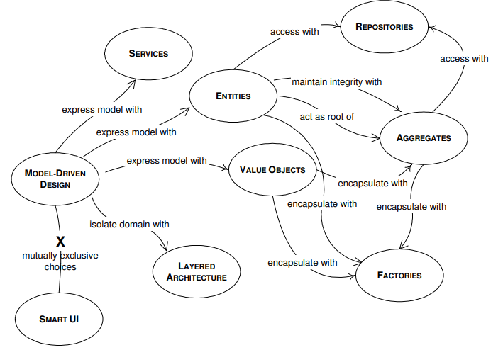
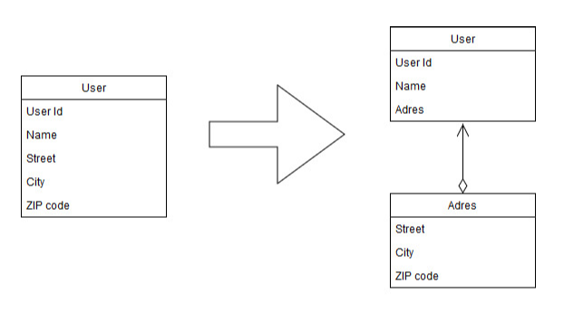

# Quick DDD Notes

## Model

The, so called, **Model** is the abstraction of the **Domain**.

The Domain comes to light talking to the _Domain Experts_, which are the
business experts.

The abstraction is the model. This is not a diagram but the idea that the
diagram is intended to convey.

Sometime the domain contain too much, so we must leave parts out of our model.

We should be able to communicate the Model.

- Graphical Diagrams
- Writing
- Language

Only once we are sure we can communicate the model we can start to design our
code.

**Software Design:** The big pictures, where the walls of a house are going to
be placed.

**Code Design:** Detail, where certain painting is going to be hang.

Code design mistakes are easy to correct, the totally opposite happens with
Software design mistakes.

**Analysis Paralysis:** Teams members so afraid of making any design decision
that end up making no progress at all.

## The Ubiquitous Language

One different person uses different words when writing than when speaking.
Sometimes, even in the same sentences.

A core principle of DDD is to use a language **based on the model**.

That language and the models are strongly interconnected with one another. A
change in the language is a change in the model.

**_Domain experts should easily understands the both the language and the
model._**

The language can be expressed in text, diagrams, etc. (UML diagrams are not
recommended by this book)

## Model Driven Design

**Very important details are discovered during the design and implementation
process.** A Model that is truthful to the Domain can turn out to have serious
problems with object persistence, or unacceptable performance behaviour. The
Model should be constructed with an eye open to the software and design
considerations. **Developers should be included in the modeling process**. This
ensures that the model can actually be implemented.

"Procedural programming does not suit well Model driven Design"

### The building blocks of a Model Driven Design

## Layered Architecture

A common architectural solution for domain-driven designs contain four conceptual layers:

**User Interface** (Presentation Layer):
Responsible for presenting information to the user and interpreting user
commands.

**Application Layer:**
This is a thin layer which coordinates the application activity. It does not
contain business logic. It does not hold the state of the business objects, but
it can hold the state of an application task progress.

**Domain Layer:**
This layer contains information about the domain. This is the heart of the business
software. The state of business objects is held here. Persistence of the
business objects and possibly their state is delegated to the infrastructure layer.

**Infrastructure Layer:** This layer acts as a supporting library for all the
other layers. It provides communication between layers, implements persistence
for business objects, contains supporting libraries for the user interface
layer, etc.

## Entities

Entities are necessary objects in the domain model and should be considered
from beginning of the modeling.

An Object must be an Entity as long as it has identity. For these objects is not
the attributes that matter, but the thread of continuity and identity.

Usually the identity is either an attribute of the object, a combination of
attributes or an attribute specially created to preserve and express identity,
or even a behaviour.
The "ID" could be auto generated by a module, could be the PK of a table in a DB
or it could be created by the user.

This means of identification may come from outside or it may be created by and
for the system, bit it must correspond to the identity distinctions in the model.
The model must define what it means to be the same thing.

Beware of considering all objects entities, there may be performance issues.
(Consider the case of a drawing App explained in the book)

## Value Objects

There are cases where we need to contain some attributes of a domain element we
are not interested in which object it is, but what attributes it has. An object
that is used to describe certain aspects of a domain, and which does not have
identity, is name value object.

It is highly recommendable that these objects are immutable, even more if they
are sharable

Value objects  should stay thin, making a copy of a V.O should be easy.

Value Objects, can contain other value objects, and they can even contain
references to entities. Although V.O attributes of a domain object, that does
not mean that it should contain a long list with all the attributes.
Attributes can be grouped in different objects. Attributes chosen to make up a
V.O should form a conceptual whole.
 

## Services

Some aspects of the domain are not easily mapped to objects,. Objects are
generally considered as having attributes, an internal state which is managed by
the object, and exhibit a behaviour.

The nouns of the language are easily mapped to objects, the verbs of the
language become the part of the behaviour of those objects. But there are some
actions in the domain, some verbs, which do not seem to belong to any object.
They represent an important behaviour of the domain, so they cannot be neglected
or simply incorporated to some of the Entities or Value Objects. Nonetheless,
using an OO language, we have to use an object for this purpose. 

When such a behaviour is recognized in the domain, the best practice is to
declare it as a Service. Such object does not have an internal state, and it
purpose is to provide functionality to the domain. The Service can group
related functionality which serves Entities and Value Objects. 

Services must be declared explicitly, they must encapsulate a concept. We should
not create a Service for each operation needed. But when such an operation
stands out as an important concept in the domain.

A Service is not about the object performing the service, but is related to the
objects the operations are performed on/for. They usually become the point of
connection for many objects.

There are 3 characteristics of a Service:
    1. The operation performed by a Service refers to a domain concept which
       does not naturally belong to an Entity or Value Object
    2. The operation performed refers to other objects in the domain.
    3.  The operation is stateless

It is easy to confused services which belongs to the domain and those that
belong to the infrastructure. (To read more about it please refer to the last
part of the "Service" chapter where some examples are provided)

