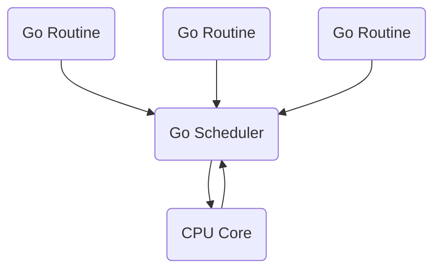
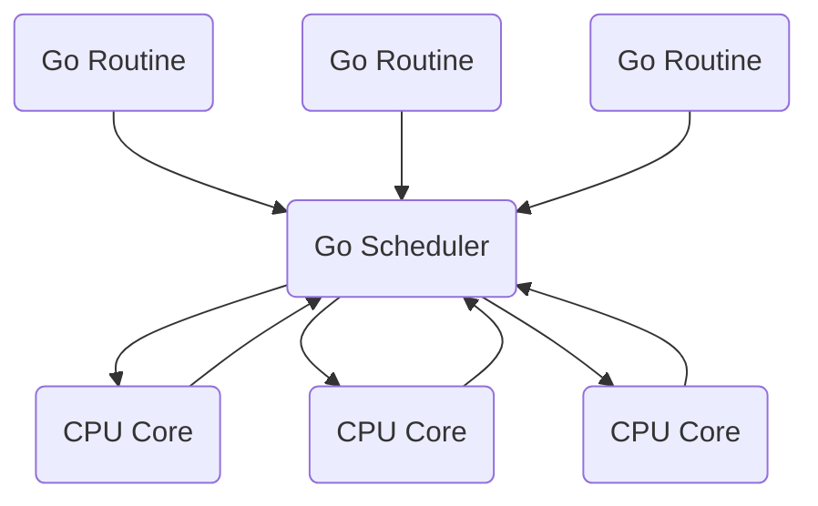

# Channels and Routines


## Link checker

Let's take a look to the following code. It intends to check if a list of links are online. 

```go
func main() {
    links := []string{
        "https://lucascontre.site",
        "http://emby.lucascontre.site",
        "https://lucaslois.io",
    }
    for _, link := range links {
        checkLink(link)               
    }
}

func checkLink(link string) {
    _, err := http.Get(link) // Blocking code
    if err != nil {
        fmt.Println(link,"might be down!")
        return
    }
    fmt.Println(link, "is up!")
}   
```

## Go Routine

Every time we run a go program we are launching a go routine. We can think of the go routine as a process that executes our code "line by line".

We can add concurrency to our **Link checker** just be adding the work `go` before executing the `checkLink()` function.

```go
//  for _, link := range links {
        go checkLink(link) // Spawns a new Go Routine
    //}
```

This way Go will launch a new thread (go routine) that executes that function and the main go routine will keep on iterating through the loop. Seems pretty straight forward, but this is far from over. There are a lot of interesting rules, side effects and a lot of theory behind the scenes.

### What are go routines doing on our machine

Behind the scenes theres something called the **Go Scheduler**. The scheduler runs one routine until it finishes or makes a blocking call (like the HTTP request).



By default the scheduler will try to run everything on one core. So when we have only one cpu we are still actually running one go routine at a time. To run multiple go routines at the same time we will need several cores. But **concurrency is not parallelism.**



If you've just added the `go` word to our function and tried to run it, you might have seen that when you run it nothing is printed out. What's happening is that our main routine (the one that launched our  other ***n*** *child* go routines) finished before their children.

To fix this issue we will make a good use of channels.

## Channels

Channels are the only way we have to communicate different go routines. We can think of a channels as an in mediator through which we can send data through routines. Channels are *tight*, which means, that messages that goes through a channel must be of the same type. 

### Channel implementation

```go

func main() {
    links := []string{
        "https://lucascontre.site",
        "http://emby.lucascontre.site",
        "https://lucaslois.io",
    }
    c := make(chan string)
    for _, link := range links {
       go checkLink(link,c)
    }
    for i := 0; i < len(links); i++ {
        fmt.Println(<-c)
    }
   // fmt.Println(<-c) // Prints the first msg to arrive
   // fmt.Println(<-c) // Prints the second msg to arrive
   // fmt.Println(<-c) // Prints the third msg to arrive
   // fmt.Println(<-c) // Hangs because is waiting for a msg to be receive to the channel
}

func checkLink(link string, c chan string) {
    _, err := http.Get(link)
    if err != nil {
        c <- link + " Link is down :("
        return
    }
    //fmt.Println(link, "is up!")
    c <- link + " Link is up :)"
    return
}

```

We might want to send data from the **Main routine** through the **channel** to our **child routines** or vice versa. For this Go has an special syntax

```go
channel <=-5 // Send the value '5' into this channel
myNumber <- channel // Wait for a value to be sent into the channel. When we get one, assign the value to 'myNumber'
gmt.Println(<-channel) // Wait for a value to be sent into the channel. When we get one, log it out immediately.
```

An important thing to have in mind is that **receiving messages through a channel is a blocking thing.** 

## Repetitive Routines

In case we would like to repeat a routine once it's done we can re-call it inside the for loop. Also making the the functions that wraps that routine to broadcast the same parameter that's called on that function.

```go
func main() {
    links := []string{
        "https://lucascontre.site",
        "http://emby.lucascontre.site",
        "https://lucaslois.io",
    }
    c := make(chan string)
    for _, link := range links {
       go checkLink(link,c)
    }
    for {
        go checkLink(<-c, c)
    }
// A nicer syntax is 
    //for i := range c  { // This is semantically read as "For each time that channel c gets a value i, then.."
	//go checkLink( i, c) 
//}

}

func checkLink(link string, c chan string) {
    _, err := http.Get(link)
    if err != nil {
        fmt.Println(link," is down")
        c <- link
        return
    }
    fmt.Println(link, " is up!")
    c <- link 
}

```

## Function Literal

A **Function literal** in go is the exact same thing as what it would be a **Anonymous function** in Javascript or **Lambda** in Python.

```go
func main() {
    links := []string{
        "https://lucascontre.site",
        "http://emby.lucascontre.site",
        "https://lucaslois.io",
    }
    c := make(chan string)
    for _, link := range links {
       go checkLink(link,c)
    }
    for {
        go func() { // This is the "Anonymous" function
            time.Sleep(5 * time.Second)
            checkLink(<-c, c)
        }() // "()"--> calls the function.
    }
   }
```

To prevent the variable `i` to be replaced. Literal Functions have a work around. As a rule of thumb.: *Never try to access the same variable from a different child routine* 

```go
for i := range c{
        go func(link string) {
            time.Sleep(5 * time.Second)
            checkLink(l, c)
        }(i)
    }
```

