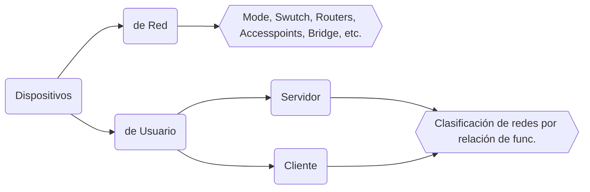
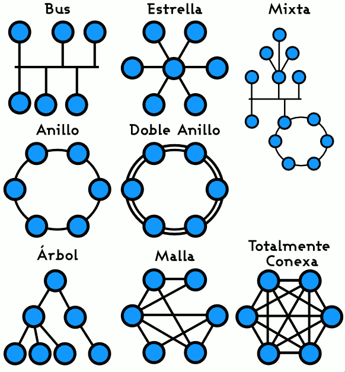
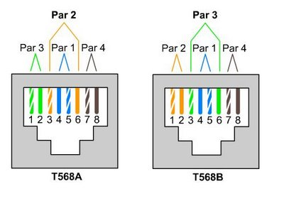

# Redes

## Qué es una red ?

​	En términos informáticos, una red es un conjunto de dispositivos que comparten Información y recursos. La comunicación dentro de una red es un proceso en el que existen 2 roles, emisor y receptor. Que se van asumiendo y alternando en distintos instantes de tiempo.  La estructura y modos de  funcionamientos de las redes informáticas y actuales se definen en varios estándares. El más extendido de esos es el modelo **TCP/IP** basado en el modelo de referencia (teórico) **OSI**.

## Entidades y conceptos de una red

### Dispositivos

​	Los distintos dispositivos que se pueden conectar a una red pueden clasificarse en 2. Los que gestionan los accesos y comunicaciones y los que se conectan para utilizarla.

Cuando todos los dispositivos de una red pueden tomar el rol de cliente y servidor y se hace imposible distinguir los roles, estamos en presencia de una arquitectura **P2P ** ( ***peer to peer*** ). 

#### Medio

​	El **medio** es la conexión que hace posible que los dispositivos se relacione entre si. Existen dos principales clasificaciones para los medios, **Dirigidos / Guiados** (Cableado) en donde encontramos al cable coaxial, cable de par trenzado (UTP/STP) y la fibra óptica o **No guiados** (Wireless) como Bluetooth, microondas o WiFi.

#### Información

​	Comprende todo elemento intercambiado entre dispositivos, tanto de gestión de acceso y comunicación, como de usuario final (texto, hipertexto, imágenes, música, video, etc.).

#### Recursos

​	Un recurso es todo aquello que un dispositivo le solicita a la red, y que puede ser identificado y accedido directamente. Puede tratarse un de archivo compartido en otra computadora dentro de la red, un servicio que se desea consumir, una impresora a través de la cual se quiere imprimir un documento, información, espacio en disco, tiempo de procesamiento, etc.

## Clasificaciones

|                  | PAN                | LAN                          | MAN                       | WAN                      |
| ---------------- | ------------------ | ---------------------------- | ------------------------- | ------------------------ |
| **Estándares**   | Bluetooth          | 802.11a, 11b, 11g, HiperLan2 | 802.11 MMDS, LMDS         | GSM, GPRS, CDMA, LTE, 4G |
| **Velocidad**    | <1 Mbps            | 2-54+ Mbps                   | 22+ Mbps                  | 10-384 Kbps              |
| **Alcance**      | Corto              | Medio                        | Medio-largo               | Largo                    |
| **Aplicaciones** | P2P (Peer-to-Peer) | Redes empresariales          | Acceso fijo, ultima milla | PDAs, celulares          |

​	También existen redes como **VLAN ** *Virtual LAN* es una red **LAN** con la particularidad de que los dispositivos de red se encuentran en diversas ubicaciones geográficas alejadas. Este tipo de red posee las particularidades de una LAN. Otros tipos de redes son **BAN**, **CAN** y **SAN**

## Topología de red

​	La **topología de red** se define como el mapa físico o lógico de una red para intercambiar datos. Los estudios de topología de red reconocen ocho tipos básicos de topología:

**Los  distintos tipos de topología son:**

* En bus (“conductor común” o bus) o lineal (line)
* En estrella (*star*)
* En anillo (*ring*) o circular
* En malla (*mesh*)
* En árbol (*tree*) o jerárquica
* Cadena margarita (*daisy chain*) (linear, uno al lado del otro sin conectar los extremos)
* Topología híbrida, combinada o mixta, por ej. circular de estrella, bus de estrella

Los distintos pros y contras que puedan llegar a tener cada topología se analizan en base a como la topología escale en términos de rendimiento según su cantidad de nodos, en la dependencia de fallos en los nodos, privacidad entre dos nodos, facilidad de  implementar la red.

#### Punto a punto (P2P)

​	La topología más simple es un enlace permanente entre dos puntos finales conocida como punto a punto (**P2P**). La topología punto a punto conmutada es la pasarela básica de la telefonía convencional. El valor de una red permanente de P2P es la comunicación sin obstáculos entre los dos puntos finales. El valor de una conexión P2P a demanda es proporcional al número de pares posibles de abonados y se ha expresado como la [ley de Metcalfe](https://es.wikipedia.org/wiki/Ley_de_Metcalfe).

## Estándares Ethernet

​	*Ethernet* es un estándar de red con varias versiones y es muy utilizado en redes LAN que implementan el protocolo de acceso al medio compartido CSMA/CD (Carrier Sense Multiple Access with Collision Detection). Existen distintos tipos de tecnologías Ethernet con distintas velocidades de trasmisión, tipo de cable, topología y longitudes máxima.

**Distintas tecnologías Ethernet**

| Tecnología | Velocidad de transmisión | Tipo de cable                 | Distancia máxima | Topología                                          |
| ---------- | ------------------------ | ----------------------------- | ---------------- | -------------------------------------------------- |
| 10Base2    | 10 Mbit/s                | Coaxial                       | 185 m            | Bus (Conector T)                                   |
| 10BaseT    | 10 Mbit/s                | Par Trenzado                  | 100 m            | Estrella (Hub o Switch)                            |
| 10BaseF    | 10 Mbit/s                | Fibra óptica                  | 2000 m           | Estrella (Hub o Switch)                            |
| 100BaseT4  | 100 Mbit/s               | Par Trenzado (categoría 3UTP) | 100 m            | Estrella. Half Duplex (hub) y Full Duplex (switch) |
| 100BaseTX  | 100 Mbit/s               | Par Trenzado (categoría 5UTP) | 100 m            | Estrella. Half Duplex (hub) y Full Duplex (switch) |
| 100BaseFX  | 100 Mbit/s               | Fibra óptica                  | 2000 m           | No permite el uso de hubs                          |
| 1000BaseT  | 1000 Mbit/s              | (categoría 5e ó 6UTP )        | 100 m            | Estrella. Full Duplex (switch)                     |
| 1000BaseSX | 1000 Mbit/s              | Fibra óptica (multimodo)      | 550 m            | Estrella. Full Duplex (switch)                     |
| 1000BaseLX | 1000 Mbit/s              | Fibra óptica (monomodo)       | 5000 m           | Estrella. Full Duplex (switch)                     |

​	En una red LAN que utiliza Ethernet el medio de transporte más común suele ser el par trenzado. Cuenta de 4 pares de cables que se pueden disponer de la siguiente manera.

Los cables de datos están constituidos por grupos de pares trenzados, cables multipares, en los que podemos encontrar cables de 2,4,6,8,14, ,25 ,28, 56, 112, 224 o hasta 300  pares. (Los cables de pares mayores a 25 son generalmente utilizados por empresas de servicio y su cableado es subterráneo).

Los cables de par trenzados se dividen en 10 **categorías** (1, 2, 3, 4, 5, 5e, 6, 6e, 7 y 8) y se diferencian en diseño, aislamiento de los cables y demás mejoras para mayor velocidades de trasmisión de datos. También puede diferenciarse por su **recubrimiento** (**UTP** (*Unshielded Twisted Pair*), **STP** (*Shielded*), **FTP **(Foiled), **SFTP **(*Screen Fullyshielded*),) 

### Fibra Óptica 

La fibra óptica, a diferencias del par trenzado, se utiliza para cubrir grandes distancias. Es más costosa pero ofrece mayor velocidad de transferencia.