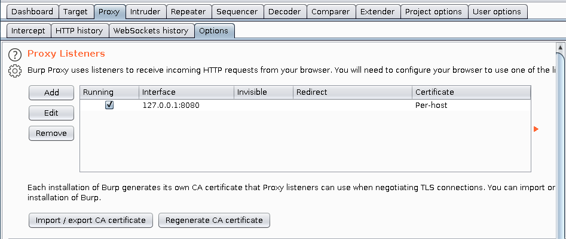
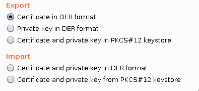
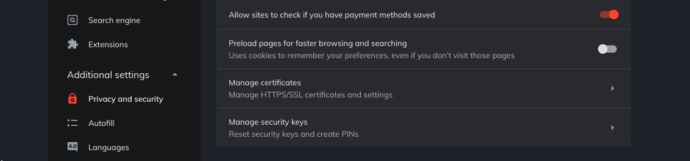
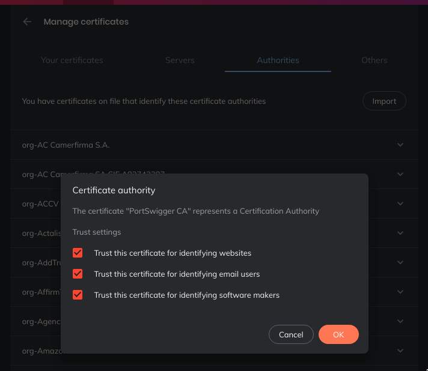

# Burp Suite

Burp Suite is a leading range of cybersecurity tools, brought to you by PortSwigger. We believe in giving our users a competitive advantage through superior research.

## Proxy

Burp is designed to be used alongside your browser. Burp functions as an HTTP proxy server, and all HTTP/S traffic from your browser passes through Burp. To do any kind of testing with Burp, you need to configure your browser to work with it.

Guide on how to configure burp *https://portswigger.net/support/configuring-your-browser-to-work-with-burp*

## Firefox

For firefox you can download FoxyPorxy to change quick to Burp's proxy.

### Chrome based browsers

For chrome based browser there's an extension similar to FoxyProxy called [Switch Omega](https://chrome.google.com/webstore/detail/proxy-switchyomega/padekgcemlokbadohgkifijomclgjgif) but for all chrome browser, in order to navegate https website freely you will need to import burps cetificate.

To do so go to the Proxy>Options and inside *Proxy Listeners* export the CA certificate

After that Export it as a der format:

Then (on Brave for example) go to **Settings > Advanced Settings > Manage Certificates**

The under **Authorities** import  the certificate and trust each aspect of it.

